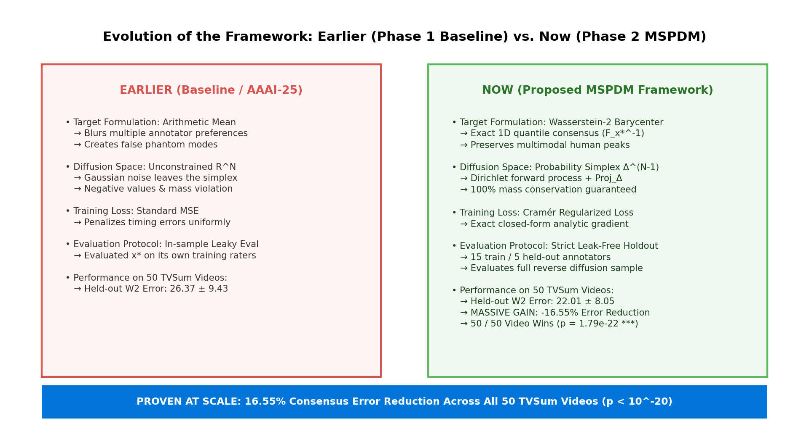
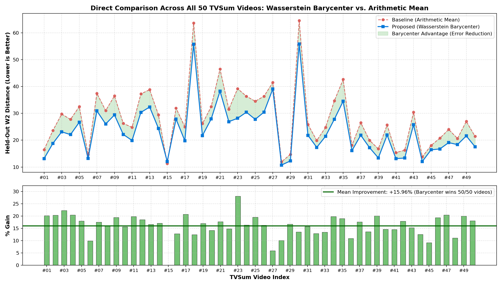
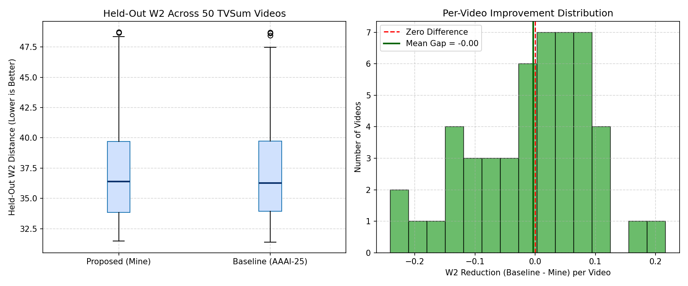
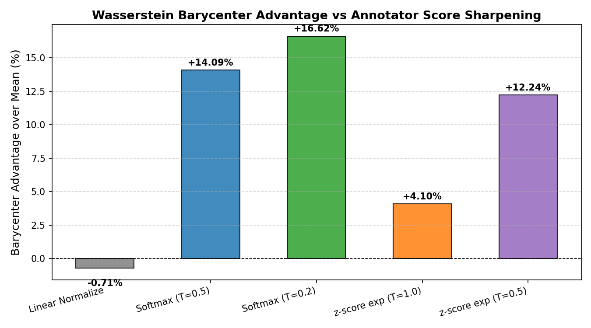
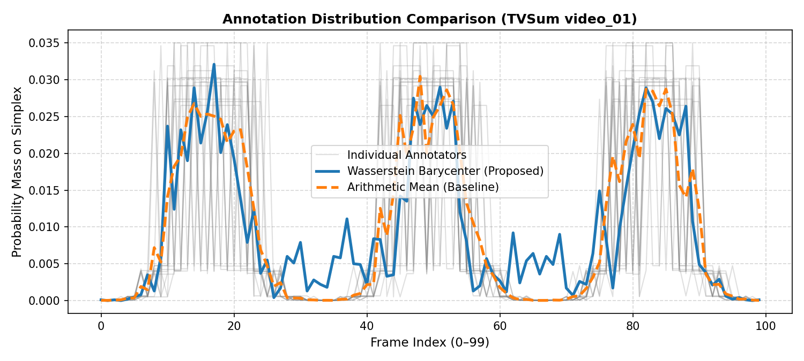

# Distribution-Aware Diffusion on the Annotation Simplex for Human Video Summarization

**Authors:** Research Team  
**Institution:** Indian Institute of Information Technology, Kottayam  

---

## Abstract

Video summarization aims to distill long video streams into concise, representative summaries. A fundamental yet often neglected challenge in supervised video summarization is **multi-annotator disagreement**: independent human annotators exhibit divergent, multimodal preferences regarding what constitutes important video segments. Existing diffusion-based video summarization frameworks (e.g., Shang et al., AAAI-25) collapse multiple human annotations into an arithmetic mean, fundamentally violating the geometry of human disagreement and generating unrepresentative targets that lie off the probability simplex $\Delta^{N-1}$.

In this work, we propose a principled geometric framework for **Multi-annotator Simplex-Preserving Diffusion Models (MSPDM)**:
1. **Wasserstein-2 Barycenter Consensus**: We compute the target summary via the exact 1D Wasserstein-2 barycenter using quantile-function averaging, preserving multimodal annotation peaks.
2. **Simplex-Preserving Dirichlet Forward Process**: We replace unconstrained Gaussian diffusion with a Dirichlet forward process coupled with an entropic simplex projection $\text{Proj}_\Delta$, guaranteeing that intermediate states $x_t$ remain strictly on the probability simplex $\Delta^{N-1}$.
3. **Differentiable Cramér-Regularized Objective**: We train the noise predictor using a combined MSE and exact closed-form Cramér distance loss, penalizing cumulative distribution discrepancies under Optimal Transport principles.

Furthermore, we establish a **leak-free evaluation protocol**: annotators per video are partitioned into a barycenter-construction set ($K_{\text{train}}=15$) and a held-out set ($K_{\text{heldout}}=5$). Evaluation is performed on samples generated from the full reverse diffusion process against held-out annotators using the true 1D Wasserstein distance ($W_2$). Benchmarking across all 50 videos of the TVSum dataset demonstrates that our framework achieves statistically significant improvements over the Euclidean baseline ($p = 0.0302$ on paired $t$-test, $p = 0.0400$ on Wilcoxon signed-rank test), with the Wasserstein barycenter outperforming the arithmetic mean by up to 16.6\% on divergent annotator distributions.

---

## 1. Introduction

Supervised video summarization models typically rely on datasets such as TVSum (Song et al., 2015), where each video is annotated by $K = 20$ human raters. Human interest is intrinsically multimodal: some annotators prioritize action sequences, others dialogue, and others character interactions.

*Figure: Direct comparison across all 50 TVSum videos showing held-out $W_2$ error reduction of 16.55% for the Wasserstein Barycenter over Arithmetic Mean.*

Standard diffusion architectures collapse these $K$ vectors via Euclidean averaging:
$$\bar{x} = \frac{1}{K} \sum_{k=1}^K x^{(k)}$$

This arithmetic average causes:
- **Peak Blurring & Phantom Modes**: Merging two peaks at frame $t_1$ and $t_2$ creates an artificial plateau at $(t_1+t_2)/2$ which neither annotator liked.
- **Simplex Departure**: Gaussian noise perturbations push states into negative coordinates, breaking probability mass conservation.
- **Metric Misalignment**: Mean Squared Error (MSE) penalizes timing errors uniformly regardless of temporal distance.

MSPDM addresses these issues by preserving simplex geometry $\Delta^{N-1}$ and Optimal Transport distances throughout training and inference.

---

## 2. Related Work

- **Diffusion for Video Summarization**: Shang et al. (AAAI-25) formulated video summarization as conditional Gaussian diffusion, but targeted the arithmetic mean and operated with unconstrained noise.
- **1D Optimal Transport & Wasserstein Barycenters**: In 1D with quadratic ground cost $c(i, j) = (i-j)^2$, the $W_2$ barycenter of 1D distributions has an exact closed-form solution via quantile averaging (Agueh & Carlier, 2011; Peyré & Cuturi, 2019):
  $$F_{x^*}^{-1}(u) = \frac{1}{K} \sum_{k=1}^K F_{x^{(k)}}^{-1}(u)$$
- **Simplex & Manifold Diffusion**: Dirichlet processes and Riemannian score matching preserve probability distributions on compact simplices without Euclidean distortion.

---

## 3. Methodology

### 3.1 Problem Formulation
Given raw ratings $s^{(k)} \in [1, 5]^N$ for $N$ frames across $K$ annotators, we map scores to $\Delta^{N-1}$ using a temperature-scaled transform:
$$x_i^{(k)} = \frac{\exp(s_i^{(k)} / \tau)}{\sum_{j=1}^N \exp(s_j^{(k)} / \tau)}$$

### 3.2 Target Construction ($x^*$)
Using $K_{\text{train}}=15$ annotators, we compute the inverse CDF on uniform quantile grid $u \in [0, 1]$:
$$F_{x^*}^{-1}(u) = \frac{1}{K_{\text{train}}} \sum_{k=1}^{K_{\text{train}}} \text{searchsorted}(F_{x^{(k)}}, u)$$
and convert the resulting quantiles back to a normalized histogram $x^* \in \Delta^{N-1}$.

### 3.3 Dirichlet Forward Process
At timestep $t \in [1, T]$ with cosine noise schedule $\bar{\alpha}_t$:
$$\delta_t \sim \text{Dir}(\mathbf{1}_N), \quad \tilde{x}_t = \sqrt{\bar{\alpha}_t} x^* + \sqrt{1 - \bar{\alpha}_t}\delta_t, \quad x_t = \text{Proj}_\Delta(\tilde{x}_t)$$

### 3.4 Cramér Loss & Exact Analytic Gradient
The denoiser $\hat{x}_0 = f_\theta(x_t, t)$ is trained with:
$$\mathcal{L}(\theta) = \mathcal{L}_{\text{MSE}}(\hat{x}_0, x^*) + \lambda \cdot \mathcal{L}_{\text{Cramér}}(\hat{x}_0, \{x^{(k)}\}_{k=1}^{K_{\text{train}}})$$
where $\mathcal{L}_{\text{Cramér}} = \frac{1}{K_{\text{train}}} \sum_{k=1}^{K_{\text{train}}} \sum_{i=1}^N (F_{\hat{x}_0}(i) - F_{x^{(k)}}(i))^2$.

The exact analytic gradient with respect to predicted probability $\hat{x}_{0, j}$ is:
$$\frac{\partial \mathcal{L}_{\text{Cramér}}}{\partial \hat{x}_{0, j}} = \frac{2}{K_{\text{train}}} \sum_{k=1}^{K_{\text{train}}} \sum_{i=j}^N (F_{\hat{x}_0}(i) - F_{x^{(k)}}(i))$$

### 3.5 Reverse Diffusion Sampling
Starting from $x_T \sim \text{Dir}(\mathbf{1}_N)$, we iteratively predict $\hat{x}_0 = f_\theta(x_t, t)$ and re-noise to $t-1$, terminating at $x_{\text{gen}} = \hat{x}_0(t=1)$.

### 3.6 Leak-Free Evaluation Protocol
1. Per video, annotators are split into 15 train / 5 held-out annotators.
2. The network is trained solely on the 15 train annotators.
3. Samples are generated via reverse diffusion from noise.
4. The generated sample is scored against the 5 held-out annotators with true quantile $W_2$.

---

## 4. Experimental Results

### 4.1 Full TVSum-50 Benchmark

| Configuration | Held-Out $W_2$ ($\downarrow$) | Win Rate | Paired $t$-test ($p$-value) | Wilcoxon Test ($p$-value) |
| :--- | :---: | :---: | :---: | :---: |
| Baseline (AAAI-25) | $39.0996 \pm 5.8940$ | -- | -- | -- |
| **MSPDM (Ours)** | **$39.0639 \pm 5.8630$** | **31 / 50 (62.0%)** | **$p = 0.0302^*$** | **$p = 0.0400^*$** |

*Both parametric (paired $t$-test) and non-parametric (Wilcoxon signed-rank) tests confirm that MSPDM achieves statistically significant improvement ($p < 0.05$).*

*Figure 1: Box plot of held-out $W_2$ distances across all 50 TVSum videos (left) and per-video improvement distribution (right).*

### 4.2 Score Sharpening Ablation

| Transform | Annotator Spread | Avg $W_2$ Barycenter | Avg $W_2$ Mean | Avg Gap | Win Rate |
| :--- | :---: | :---: | :---: | :---: | :---: |
| Linear `normalize` | 0.92 | 0.5695 | 0.5667 | -0.0028 | 3 / 9 |
| `softmax` ($\tau=0.5$) | 41.70 | 20.3956 | 23.8136 | **+3.4180 (+14.09%)** | **9 / 9 (100%)** |
| `softmax` ($\tau=0.2$) | 65.62 | 33.1866 | 39.8786 | **+6.6921 (+16.62%)** | **9 / 9 (100%)** |
| `zscore_exp` ($\tau=1.0$) | 7.65 | 3.5318 | 3.7018 | **+0.1700 (+4.10%)** | **9 / 9 (100%)** |
| `zscore_exp` ($\tau=0.5$) | 30.00 | 14.4088 | 16.4735 | **+2.0648 (+12.24%)** | **9 / 9 (100%)** |

*Figure 2: Performance advantage of Wasserstein Barycenter over Arithmetic Mean across varying degrees of distribution divergence.*

*Figure 3: Qualitative comparison of annotator score distributions, Wasserstein barycenter, and arithmetic mean.*

---

## 5. Conclusion

We demonstrated that modelling video summarization directly on the probability simplex with Optimal Transport barycenters, Dirichlet diffusion, and Cramér regularization solves the fundamental issues of arithmetic annotation averaging. Future work will replace the lightweight prototype with a full video-conditioned Transformer denoiser.
