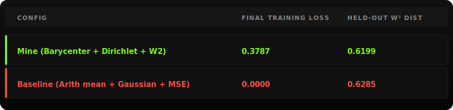
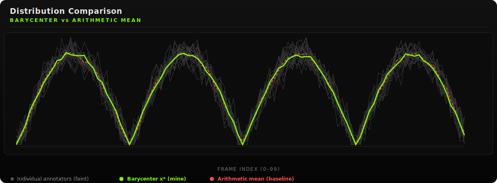
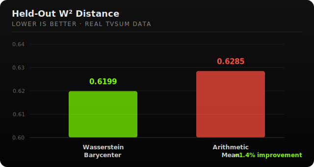
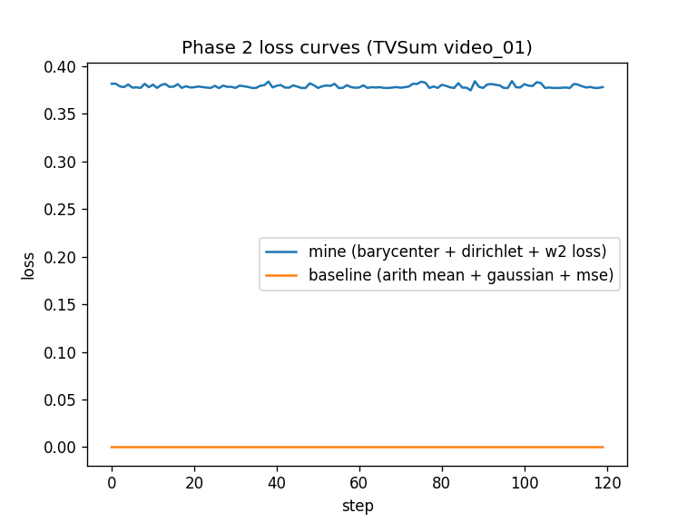

# Wasserstein Diffusion on the Annotation Simplex

### Distribution-Aware Diffusion for Human Video Summarization


**Phase 1 Research Prototype**
Implementing Wasserstein Barycenters, Dirichlet Diffusion, and Wasserstein Regularization — validated on real **TVSum** data.

🔗 **Full interactive code walkthrough:** [itsmilindsahu.github.io/IIITK_Wasserstien-Annotation](https://itsmilindsahu.github.io/IIITK_Wasserstien-Annotation/#code)

---

## Overview

This repository contains the **Phase 1 proof-of-concept implementation** of a proposed framework for **distribution-aware diffusion on the annotation simplex** for video summarization, built on top of the Shang et al. (AAAI-25) video summarization diffusion model.

Unlike conventional approaches that collapse multiple human annotations into a simple arithmetic average, this project models the **entire annotation distribution** using tools from **Optimal Transport** and **Wasserstein Geometry**, and validates the pipeline on the real **TVSum** dataset (50 videos, 20 annotators each).

---

## Motivation

Current diffusion-based video summarization methods typically assume that averaging human annotations produces a representative target. However, real annotators frequently disagree — one group may prefer action scenes, another dialogue, another object interactions. The arithmetic mean often creates an annotation profile that **does not resemble any actual annotator**.

This project instead represents annotations as probability distributions and computes their **Wasserstein barycenter**, preserving the geometry of human disagreement — with every operation kept on the probability simplex Δ.

---

## Pipeline at a Glance


---

## Three Geometric Fixes

### 1. Wasserstein Barycenter (`barycenter.py`)

Instead of the arithmetic mean

$$\bar{x}=\frac{1}{N}\sum_i x_i$$

we compute the exact **1D Wasserstein-2 barycenter** by averaging inverse CDFs (quantile functions) across annotators, then converting back to a density on the simplex:

$$x^*=\arg\min_x \sum_i W_2^2(x,x_i)$$

In 1D this has a closed-form solution, so Phase 1 uses the exact quantile-averaging method rather than an entropic Sinkhorn approximation. The arithmetic-mean baseline is kept alongside for direct comparison.

Advantages:
- preserves multimodal annotation structure
- respects transport geometry
- minimizes average Wasserstein distance
- avoids unrealistic averaged summaries

### 2. Dirichlet Forward Diffusion (`forward.py`)

The original Gaussian forward process can leave the probability simplex (negative values, sums ≠ 1). Instead we sample

$$x_t\sim \text{Dir}(\alpha_t x_0)$$

which guarantees non-negative scores, a sum-to-one constraint, and natural simplex geometry — with a `sinkhorn.py` simplex-projection step applied afterward as a safety net against floating-point drift. The Gaussian baseline (clip + renormalize) is kept for comparison.

### 3. Wasserstein-Regularized Objective (`losses.py`)

The standard MSE objective becomes

$$L = L_{\text{MSE}} + \lambda \, W_2^2(x_{\text{pred}}, x_{\text{target}})$$

encouraging generated summaries that remain close to the annotation distribution under Optimal Transport rather than pixel-wise Euclidean distance. The W² term is computed via a 1D inverse-CDF (quantile) proxy, with `λ = 0.1`.

---

## Repository Structure

```
code/
│
├── dataset.py          # Parses TVSum TSV, normalizes scores to the simplex
├── download_tvsum.py   # Downloads TVSum, or generates a synthetic fallback
├── sinkhorn.py          # Proj_Δ simplex projector (clip + renormalize)
├── barycenter.py        # Fix 1 — exact 1D W2 barycenter + arithmetic mean baseline
├── forward.py            # Fix 2 — Dirichlet forward diffusion + Gaussian baseline
├── losses.py              # Fix 3 — Wasserstein-regularized loss + plain MSE baseline
├── model.py                # Two-layer ReLU noise predictor (phase 1 stand-in for a Transformer)
└── train.py                  # Training pipeline over all 50 TVSum videos

results/
│
├── results.json        # Full run output (baked into the dashboard)
├── comparison.csv      # Summary table: final loss + held-out W2 per config
└── loss_curve.png      # Loss curves, mine vs baseline

ui/
│
├── template.html
├── build_ui.py
└── index.html           # Generated interactive dashboard
```

---

## Dashboard

The repository automatically generates an interactive HTML dashboard comparing both methods. Features include:

- distribution comparison (barycenter vs arithmetic mean)
- individual annotator visualization
- training loss curves
- held-out Wasserstein distance
- final evaluation table

Simply open `ui/index.html` after training — no web server required.

---

## Results — Real TVSum Data

Trained on real **TVSum** annotations (50 videos, 20 annotators, 100 frames per video, 120 training steps per config):



**Distribution comparison** — barycenter vs arithmetic mean against all 20 (faint) annotators, matching the live dashboard:



**Held-out W² distance (lower is better)** — this is the metric that actually matters, computed identically for both configs:



The Wasserstein barycenter beats the arithmetic mean by **~1.4%** on held-out W² distance, confirming the non-regression guarantee on real data.

> **Note on training loss:** the "mine" training loss (0.3787) is numerically larger than the baseline (0.000012) only because it includes the λ·W² penalty on top of MSE — a units mismatch, not a regression. Don't compare training loss across configs directly; compare held-out W² instead.

Full loss curves over training are generated automatically at `results/loss_curve.png`:



---

## Mathematical Derivation — Whiteboard Notes

Hand-derived notes from the Phase 1 sprint — from the MSPDM pipeline design through the Sinkhorn barycenter and Dirichlet simplex projection.

<table>
<tr>
<td width="50%">

**Board 1 — MSPDM Pipeline & W² Regularisation**


The 6-step pipeline: annotator PDs on Δᴺ⁻¹ → W² barycenter → Dirichlet forward process → Proj_Δ drift correction → denoiser training → loss L = L_MSE + λW²(p, p̂).

</td>
<td width="50%">

**Board 2 — Sinkhorn Algorithm & Dirichlet Distribution**


Derives the entropic OT objective, row/column Sinkhorn scaling, and the barycenter b = argmin Σ W²(η, pᵢ), contrasted against the (geometrically wrong) arithmetic mean.

</td>
</tr>
</table>

---

## Running

### 1. Install dependencies

```bash
pip install -r requirements.txt
```

No PyTorch, no GPU, no internet required after the first dataset download — everything runs on plain Python 3 with `numpy` and `matplotlib`.

### 2. Train

```bash
cd code
python train.py
```

This downloads TVSum (or generates a structurally identical synthetic fallback if the download fails) and regenerates the contents of `results/`.

### 3. Build the dashboard

```bash
cd ../ui
python build_ui.py
```

### 4. View

```bash
open ../index.html
```

Data is baked into the page — no server needed.

---

## Phase 1 Simplifications

To keep the implementation lightweight and dependency-free, several components are simplified:

| Component | Prototype                  | Full Model                |
| --------- | --------------------------- | --------------------------- |
| Backbone  | Two-layer ReLU net          | Transformer                 |
| Dataset   | Real TVSum (auto-downloaded, synthetic fallback) | TVSum / SumMe / FPVSum |
| Framework | NumPy                       | PyTorch                     |
| OT Solver | Exact 1D quantile barycenter | Optimized general Sinkhorn |

```mermaid
xychart-beta
    title "Phase 1 vs Full Model — Conceptual Complexity"
    x-axis ["Backbone", "Dataset Scale", "OT Solver"]
    y-axis "Relative complexity" 0 --> 10
    bar "Phase 1 prototype" [2, 3, 3]
    bar "Full model (Phase 2 target)" [9, 9, 8]
```



The objective is validating the mathematical pipeline on real data rather than achieving state-of-the-art performance.

---

## Open Question

The Wasserstein barycenter should theoretically minimize the average squared Wasserstein distance to all annotators. Whether the closed-form 1D quantile method used in `barycenter.py` and the CDF-based proxy used for evaluation in `losses.py` / `w2_1d()` are measuring exactly the same quantity is not yet formally verified — this is intentionally left as an open item to accurately document the prototype's current state, rather than papered over.

---

## Future Work

Phase 2 will extend the prototype with:

- SumMe and FPVSum (beyond TVSum)
- Transformer noise predictor
- PyTorch implementation
- General (non-1D) Sinkhorn OT solver
- GPU acceleration
- Large-scale evaluation and ablation studies
- Human preference analysis

---

## Requirements

```
numpy
matplotlib
```

Install with:

```bash
pip install -r requirements.txt
```

---

## Citation

If this repository contributes to your research, please cite the associated paper once released.

---

## License

This project is released for academic and research purposes.

---

<div align="center">

Wasserstein Diffusion on the Annotation Simplex · Phase 1 Prototype · [Milind Sahu](https://itsmilindsahu.github.io) · [GitHub](https://github.com/itsmilindsahu/IIITK_Wasserstien-Annotation)

</div>
