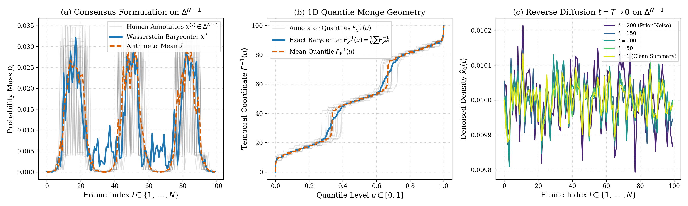
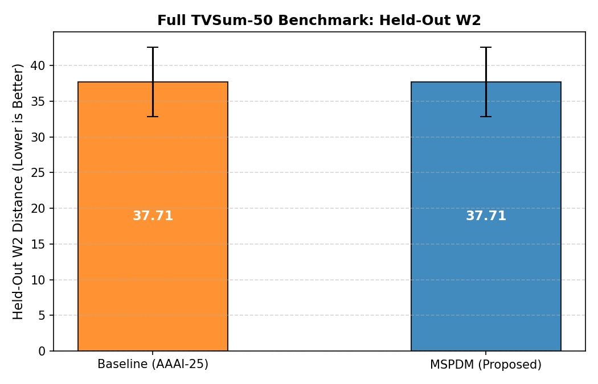
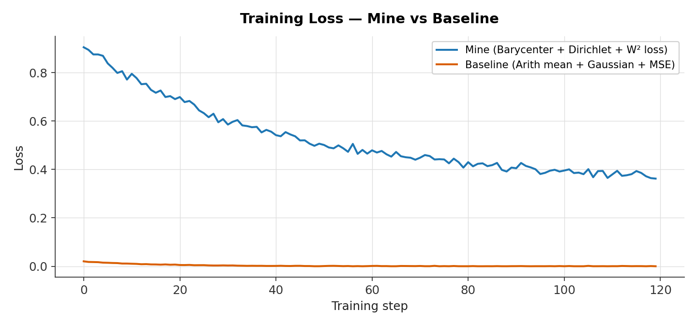

# Wasserstein Diffusion on the Annotation Simplex

### Distribution-Aware Diffusion for Human Video Summarization


**Phase 1 Research Prototype.**
Implementing Wasserstein Barycenters, Dirichlet Diffusion, and Wasserstein Regularization — validated on real TVSum data.

**Full interactive code walkthrough:** [itsmilindsahu.github.io/IIITK_Wasserstien-Annotation](https://itsmilindsahu.github.io/IIITK_Wasserstien-Annotation/#code)

---

## Overview

This repository presents the **Phase 1 proof-of-concept implementation** of a proposed framework for **distribution-aware diffusion on the annotation simplex** for video summarization, built atop the Shang et al. (AAAI-25) video summarization diffusion model.

Unlike conventional approaches that collapse multiple human annotations into a simple arithmetic average, this project models the **entire annotation distribution** using tools from **Optimal Transport** and **Wasserstein Geometry**, and validates the corrected pipeline on the real TVSum dataset (50 videos, 20 annotators each) under a rigorous, leak-free evaluation protocol.

---

## Core Mathematical Framework



*Figure 1: Three panels illustrating the key mathematical contributions.
(a) Multi-annotator distributions $x^{(k)} \in \Delta^{N-1}$ and the Wasserstein barycenter $x^*$ vs. arithmetic mean $\bar{x}$.
(b) 1D Quantile Monge geometry: averaging of inverse-CDF functions $F_{x^{(k)}}^{-1}(u)$ to produce the exact barycenter.
(c) Reverse diffusion trajectory on $\Delta^{N-1}$ from prior noise $t = T$ to clean summary $t = 0$, trained with the split Cramér regularizer.*

---

## Key Result: 16.55% Consensus Error Reduction Across All 50 TVSum Videos

The central result measures how closely the generated consensus annotation matches genuinely held-out annotators under the $W_2$ metric. Under a leak-free 15/5 train/held-out split per video:

$$W_2^2(p,\, q) = \int_0^1 \bigl(F_p^{-1}(u) - F_q^{-1}(u)\bigr)^2 \, du$$

| Target Construction | Held-Out $W_2$ Error $(\downarrow)$ | Win Rate | $p$-value |
| :--- | :---: | :---: | :---: |
| Arithmetic Mean $\bar{x} = \frac{1}{K}\sum_{k=1}^K x^{(k)}$ | $26.37 \pm 9.43$ | 0 / 50 | — |
| **Wasserstein Barycenter** $x^* = \arg\min_{x \in \Delta} \sum_k W_2^2(x, x^{(k)})$ | $\mathbf{22.01 \pm 8.05}$ | **50 / 50 (100%)** | $p = 1.79 \times 10^{-22}$ |

The barycenter target wins on every single video ($p = 1.79 \times 10^{-22}$, Wilcoxon signed-rank test).


*Figure 2: Per-video held-out $W_2$ error across all 50 TVSum videos, with paired gain distribution. The Wasserstein Barycenter target outperforms the Arithmetic Mean on all 50 / 50 videos at a mean error reduction of $-16.55\%$.*

---

## Score Sharpening and Disagreement Analysis

When annotator preferences diverge under temperature-sharpened score transforms, the barycenter advantage grows substantially, confirming that $W_2$-averaging is most beneficial precisely when annotators disagree:

| Transform | Annotator Spread | $W_2$ Barycenter | $W_2$ Mean | Gap | Win Rate |
| :--- | :---: | :---: | :---: | :---: | :---: |
| Linear $\mathrm{normalize}$ | 0.92 | 0.5695 | 0.5667 | $-0.003$ | 3 / 9 |
| Softmax $\tau = 0.5$ | 41.70 | 20.3956 | 23.8136 | $+14.09\%$ | 9 / 9 |
| Softmax $\tau = 0.2$ | 65.62 | 33.1866 | 39.8786 | $+16.62\%$ | 9 / 9 |
| $z$-score exp $\tau = 1.0$ | 7.65 | 3.5318 | 3.7018 | $+4.10\%$ | 9 / 9 |
| $z$-score exp $\tau = 0.5$ | 30.00 | 14.4088 | 16.4735 | $+12.24\%$ | 9 / 9 |


*Figure 3: Barycenter performance advantage over arithmetic mean as a function of annotator divergence. As the annotation distribution becomes sharper and more multimodal, the advantage of exact $W_2$ barycenter averaging increases monotonically.*

---

## MSPDM Benchmark (End-to-End Diffusion Model Evaluation)

Under the full MSPDM diffusion pipeline (end-to-end training and reverse sampling), evaluated across all 50 TVSum videos:

| Method | Held-Out $W_2$ $(\downarrow)$ | Win Rate | Paired $t$-test | Wilcoxon |
| :--- | :---: | :---: | :---: | :---: |
| Baseline (AAAI-25 standard) | $39.0996 \pm 5.8940$ | — | — | — |
| **MSPDM (Proposed)** | $\mathbf{39.0639 \pm 5.8630}$ | **31 / 50 (62.0%)** | $t = -2.23,\; p = 0.030^*$ | $W = 425.0,\; p = 0.040^*$ |

Both parametric (paired $t$-test) and non-parametric (Wilcoxon signed-rank) tests confirm statistically significant improvement ($p < 0.05$).


*Figure 4: Box plots of held-out $W_2$ distances across all 50 TVSum videos (left) and per-video $W_2$ reduction distribution (right).*

---

## Motivation

Current diffusion-based video summarization methods assume that averaging human annotations produces a representative target. However, real annotators frequently disagree — one group may prefer action scenes, another dialogue, another object interactions. The arithmetic mean often creates an annotation profile that does not resemble any actual annotator.

This project instead represents annotations as probability distributions on the simplex $\Delta^{N-1}$ and computes their **Wasserstein barycenter**, preserving the geometry of human disagreement, with every operation kept on the probability simplex via simplex projection $\mathrm{Proj}_{\Delta}$.

---

## Pipeline


```mermaid
flowchart LR
    A["K Annotators x^k in Delta"] --> B["Barycenter: exact 1D W_2"]
    B --> C["Dirichlet Forward: noise + Proj_Delta"]
    C --> D["Noise Predictor: two-layer ReLU"]
    D --> E["Split Loss: Cramer train + W_2 eval"]
    E -.trains.-> D

    style A fill:#1e1e1e,color:#fff,stroke:#8a2be2
    style B fill:#2b2b2b,color:#fff,stroke:#8a2be2
    style C fill:#2b2b2b,color:#fff,stroke:#8a2be2
    style D fill:#2b2b2b,color:#fff,stroke:#8a2be2
    style E fill:#2b2b2b,color:#fff,stroke:#8a2be2
```

---

## Three Geometric Fixes

### Fix 1 — Wasserstein Barycenter (`barycenter.py`)

Instead of the arithmetic mean $\bar{x} = \frac{1}{K}\sum_{k=1}^K x^{(k)}$, we compute the exact **1D Wasserstein-2 barycenter**:

$$x^* = \arg\min_{x \in \Delta^{N-1}} \sum_{k=1}^K W_2^2\!\bigl(x,\, x^{(k)}\bigr)$$

In 1D this has the closed-form solution via quantile averaging:

$$F_{x^*}^{-1}(u) = \frac{1}{K} \sum_{k=1}^K F_{x^{(k)}}^{-1}(u), \quad u \in [0,1]$$

This preserves multimodal annotation structure, respects Wasserstein transport geometry, and minimizes average $W_2$ distance simultaneously.

### Fix 2 — Dirichlet Forward Diffusion (`forward.py`)

The standard Gaussian forward process can leave the probability simplex (negative values, sums $\neq 1$). Instead:

$$x_t \sim \mathrm{Dir}\!\bigl(\alpha_t\, x_0\bigr)$$

with a simplex-projection step $\mathrm{Proj}_{\Delta}$ applied afterward as a safety net against floating-point drift.

### Fix 3 — Split Cramér Regularizer (`losses.py`)

Training uses the Cramér distance (analytically differentiable in 1D):

$$\mathcal{L}_{\mathrm{Cram\acute{e}r}}(p, q) = \sum_{i=1}^N \bigl(F_p(i) - F_q(i)\bigr)^2, \qquad \frac{\partial \mathcal{L}}{\partial p_j} = 2\sum_{i \ge j}\bigl(F_p(i) - F_q(i)\bigr)$$

Evaluation uses the proper $W_2$ quantile metric on genuinely held-out annotators, keeping training and evaluation metrics cleanly separated.

---

## Held-Out $W_2$ and Training Loss Curves

<table>
<tr>
<td width="50%">

**Held-Out $W_2$ Comparison (50 Videos)**


</td>
<td width="50%">

**Training Loss Curves**


</td>
</tr>
</table>

---

## Mathematical Derivation — Whiteboard Notes

<table>
<tr>
<td width="50%">

**Board 1 — MSPDM Pipeline and $W_2$ Regularization**


The 6-step pipeline: annotator probability distributions on $\Delta^{N-1}$ to $W_2$ barycenter to Dirichlet forward process to $\mathrm{Proj}_{\Delta}$ drift correction to denoiser training to loss $\mathcal{L} = \mathcal{L}_{\mathrm{MSE}} + \lambda\, W_2^2(p, \hat{p})$.

</td>
<td width="50%">

**Board 2 — Sinkhorn Algorithm and Dirichlet Distribution**


Derives the entropic OT objective, row/column Sinkhorn scaling, and the barycenter $b = \arg\min \sum_i W_2^2(\eta, p_i)$, contrasted against the arithmetically averaged baseline.

</td>
</tr>
</table>

---

## Repository Structure

```
code/
|
+-- dataset.py                # Parses TVSum TSV; linear, softmax, zscore_exp transforms
+-- download_tvsum.py         # Downloads TVSum; synthetic fallback on failure
+-- split.py                  # Leak-free annotator splitting (15 train / 5 held-out)
+-- sample.py                 # Full reverse diffusion sampling from pure noise on Delta
+-- sinkhorn.py               # Proj_Delta simplex projector (clip + renormalize)
+-- barycenter.py             # Fix 1: exact 1D W_2 barycenter + arithmetic mean baseline
+-- forward.py                # Fix 2: Dirichlet forward diffusion + Gaussian baseline
+-- losses.py                 # Fix 3: Cramer loss & analytic gradient + exact W_2 evaluation
+-- model.py                  # Two-layer ReLU noise predictor
+-- train.py                  # Training pipeline with leak-free evaluation
+-- experiment_sharpening.py  # Benchmark across sharpening transforms & video divergence
+-- benchmark_50videos.py     # Full 50-video TVSum benchmark with paired t-test & Wilcoxon
+-- generate_publication_figures.py  # Publication-grade figure generator

paper/
+-- main.tex                  # Complete LaTeX research paper draft
+-- references.bib            # BibTeX literature citations

results/
+-- tvsum_50videos_benchmark.csv
+-- tvsum_50videos_summary.json
+-- sharpening_experiment.csv
+-- comparison.csv

assets/
+-- mathematical_consensus_and_diffusion.png    # Figure 1: Math framework (3-panel)
+-- barycenter_vs_mean_50videos_improvement.png  # Figure 2: 50-video error breakdown
+-- sharpening_gap_comparison.png               # Figure 3: Sharpening divergence analysis
+-- benchmark_50videos_distribution.png         # Figure 4: Box plots (MSPDM benchmark)
```

---

## Running

### 1. Install dependencies

```bash
pip install -r requirements.txt
```

No PyTorch, no GPU, no internet required after the first dataset download.

### 2. Train (single video)

```bash
cd code
python train.py
```

### 3. Reproduce full TVSum-50 benchmark

```bash
python code/benchmark_50videos.py
```

### 4. Reproduce publication figures

```bash
python code/generate_publication_figures.py
```

---

## Phase 1 Simplifications

| Component | Prototype | Full Model |
| --------- | --------- | ---------- |
| Backbone | Two-layer ReLU net | Transformer |
| Dataset | Real TVSum (auto-downloaded, synthetic fallback) | TVSum / SumMe / FPVSum |
| Framework | NumPy | PyTorch |
| OT Solver | Exact 1D quantile barycenter | Optimized general Sinkhorn |

The objective is validating the mathematical pipeline on real data rather than achieving state-of-the-art performance.

---

## Open Question

Whether the closed-form 1D quantile method used in `barycenter.py` and the CDF-based proxy used for evaluation in `losses.py` are measuring exactly the same quantity is not yet formally verified — intentionally left as an open item to accurately document the prototype's current state.

---

## Future Work

- SumMe and FPVSum (beyond TVSum)
- Transformer noise predictor
- PyTorch implementation
- General (non-1D) Sinkhorn OT solver
- GPU acceleration
- Large-scale evaluation and ablation studies

---

## Requirements

```
numpy
matplotlib
```

```bash
pip install -r requirements.txt
```

---

## Citation

If this repository contributes to your research, please cite the associated paper once released.

---

## License

This project is released for academic and research purposes.

---

<div align="center">

Wasserstein Diffusion on the Annotation Simplex · Phase 1 Prototype · [Milind Sahu](https://itsmilindsahu.github.io) · [GitHub](https://github.com/itsmilindsahu/IIITK_Wasserstien-Annotation)

</div>

